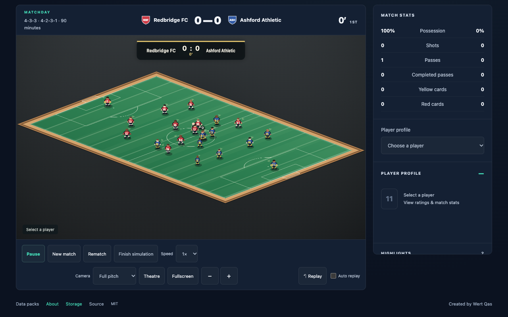

# TacticMesh

**An open-source football simulator. Bring your teams. Watch the match.**

Created by [Wert Qas](https://www.youtube.com/@wertqas9269), for the channel’s 10-subscriber special. Original software is [MIT licensed](LICENSE); pack data and images retain their separate permissions. Developed with AI-assisted coding.

## Play

Open `tacticmesh.html` in a modern desktop browser. Start with the fictional Redbridge FC and Ashford Athletic teams, import a JSON/ZIP pack, or run a 4-, 8- or 16-team knockout cup. Set lineups, formations and tactics; watch or fast-simulate the same fixed-step engine. Results include statistics, player performance ratings and local JSON/CSV/PNG exports.

Matches and imports run on your device. No TacticMesh account, paid AI call, subscription or backend is required. Export a full backup before clearing browser storage, moving devices or closing an in-memory session. A closed tab stops the simulation. Incompatible engine checkpoints remain preserved but cannot continue.

## Make and share teams

Teams → Import teams → Create with AI offers a downloadable contract kit and a copyable prompt. Attach the kit to your own assistant, request a compatible JSON/ZIP, then **Check pack → review the preview → Import teams**. The assistant is external; TacticMesh does not call an AI service.

[Pack guide](docs/PACKS.md). Share only data/images you may redistribute. Publish a pack on your own itch.io page and post its link in the project discussion board once available. Importing is local and does not publish a pack.

## Current RC limits

The selected engine is `engine-4994949ed88c0595`, core `core-d9aca92dd03969f8`. Public application `tf-136f19c256623e45` adds pack-creation help, ball/player presentation and Theatre/Fullscreen/player cards around that unchanged engine. The final local release gate passes 61 programs (52 core plus nine Product/build); hosted itch checks remain pending. Its six-match screen remains on scoring/chance-volume HOLD: 30 goals, 222 shots and 562 minutes. Results are model outcomes, not reliable predictions of real fixtures. See [known limitations](docs/KNOWN_LIMITATIONS.md).

## Build and contribute

Node 20.9+ is required for source tools. Run `npm ci`, then `npm run build`. The lockfile pins Sharp for local image validation; the browser build has no npm runtime dependency. `npm run product-test` checks Product contracts; `npm run release-check` rebuilds and runs the registered release checks. Read [CONTRIBUTING](CONTRIBUTING.md) before larger changes.

[Architecture](docs/ARCHITECTURE.md) · [Support](SUPPORT.md) · [Third-party notices](THIRD_PARTY_NOTICES.md).

The MIT source can be extended into another simulator, a direct-control football game or a management project. Those need additional development; they are not bundled modes or a stable SDK promise. Preserve licenses and review content permissions separately.

The match view has a contrasted ball and player appearance details. Theatre gives the pitch more room while keeping match controls; select a player to inspect their portrait and current match figures. Fullscreen uses the browser’s permission-controlled view, with Theatre available if it is denied or unsupported. These are presentation features, not changed football physics.
